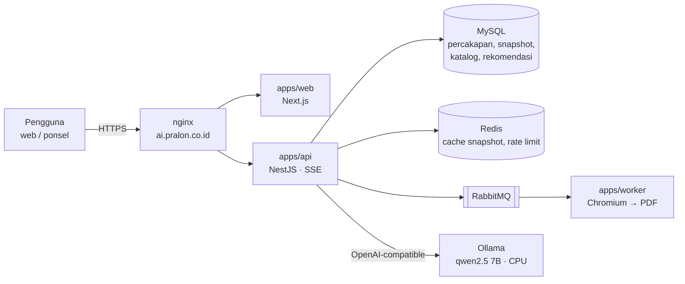
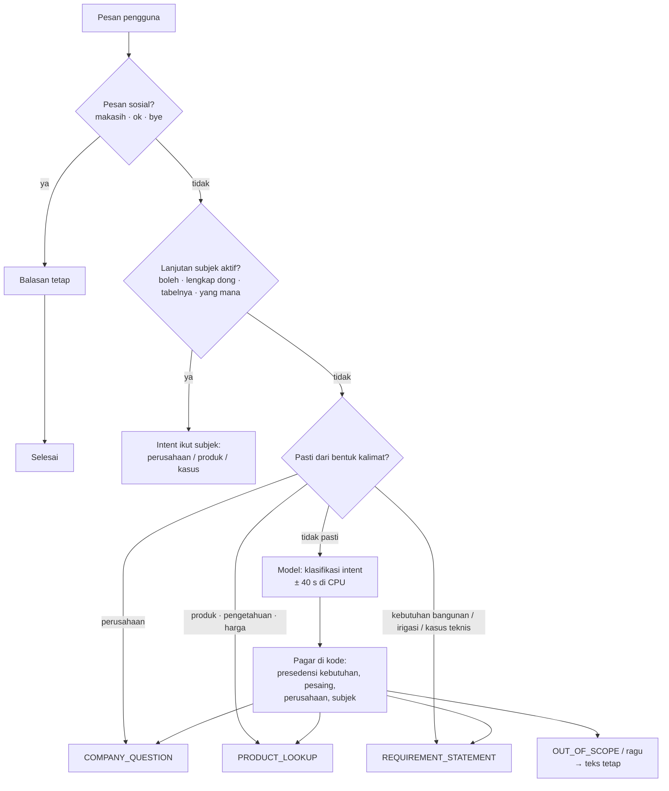
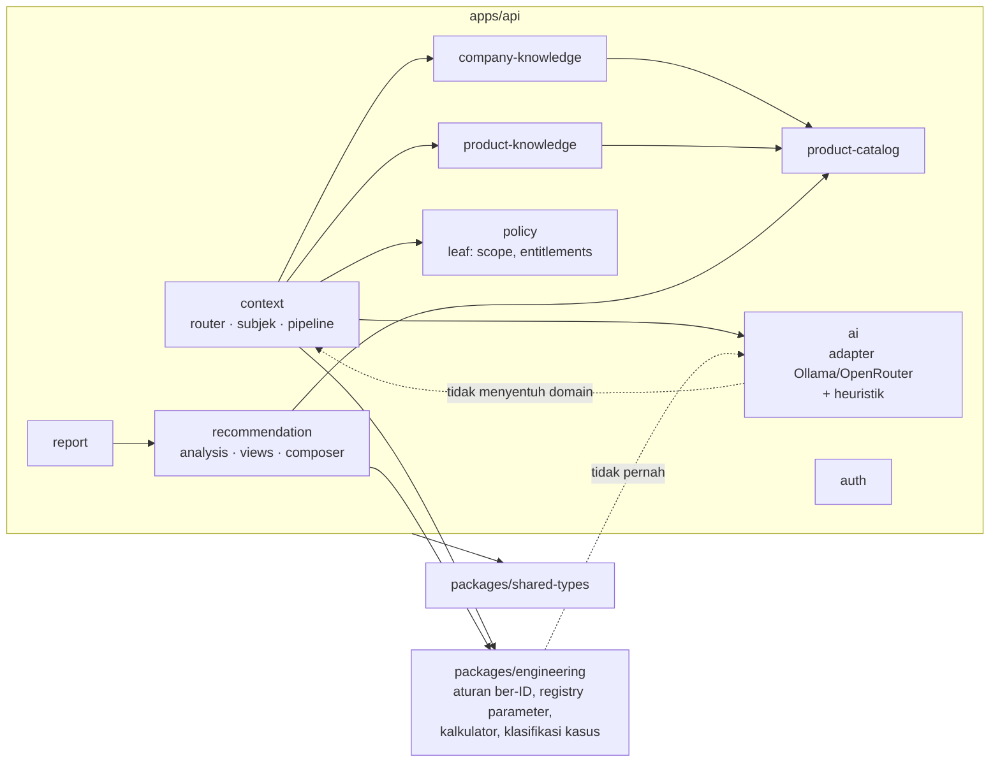
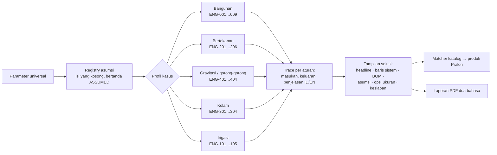

# Skema Arsitektur SNOUTY

Status per 7 Oktober 2026. Ini ringkasan untuk brainstorming; rujukan penuh ada di
`docs/ARCHITECTURE.md`, `docs/AI_BEHAVIOR.md`, dan `docs/CONTEXT_ENGINE.md`.

## 1. Prinsip yang mengikat semua keputusan

- **Model bahasa bukan sumber kebenaran teknik.** Perhitungan pipa, pompa, dan BOM selalu dari
  mesin aturan ber-ID di `packages/engineering`, tidak pernah dari LLM.
- **Tidak pernah mengarang.** Produk hanya dari katalog Pralon aktif; pengetahuan dan profil
  perusahaan hanya dari dokumen bersumber; yang tidak ada dijawab "belum bisa saya verifikasi".
- **Setiap nilai membawa provenance**: `VERIFIED`, `ASSUMED`, `ESTIMATED`, `UNAVAILABLE`. Aturan
  berstatus `REQUIRES_DOMAIN_VALIDATION` tidak pernah menghasilkan `VERIFIED`.
- **Aturan bisnis hidup di kode, bukan di prompt.** State percakapan terstruktur, bukan riwayat chat
  mentah.
- **Tanpa metatext.** Pengguna melihat jawaban teknisi, bukan label internal.
- **Hanya produk Pralon.** Kompetitor boleh dibahas sebagai konteks, tidak pernah direkomendasikan.

## 2. Topologi produksi

Satu monolith modular: tiga aplikasi, satu database. Server 4 CPU tanpa GPU di `192.168.1.10`,
dibagi dengan aplikasi lain. Setiap commit langsung dirilis lewat `deploy/deploy.sh release`.

## 3. Satu giliran chat: urutan keputusan

Urutan ini yang menentukan cepat atau lambat. Semua yang di atas kotak model berjalan 0–2 detik;
model dipanggil hanya bila jalur deterministik tidak cukup.

Ruas per intent:

| Intent                 | Yang terjadi                                                                                                                         | Panggilan model                                                   |
| ---------------------- | ------------------------------------------------------------------------------------------------------------------------------------ | ----------------------------------------------------------------- |
| Perusahaan             | Subjek aktif menentukan topik dan kedalaman; jawaban dari `company-knowledge` (bagian bersumber + ragam produk dari katalog)         | Nol                                                               |
| Produk & pengetahuan   | Harga → kebijakan; ubah bentuk → tabel/poin; lanjutan → subjek; konsep → `pipe-knowledge`; spesifikasi → katalog (SELECT)            | Hanya untuk memetakan kalimat yang tidak menyebut keluarga produk |
| Kebutuhan bangunan     | Fakta tersurat dibaca kode (lantai, kamar mandi, wastafel, dapur, toren + letak, jenis bangunan); sisanya ditanya kartu klarifikasi  | Ekstraksi hanya bila kode menangkap kurang dari dua data inti     |
| Kasus teknis & irigasi | Klasifikasi kasus dan ekstraksi parameter universal dari bentuk kalimat (ID/EN); lengkap → mesin teknik, belum → pertanyaan registry | Nol                                                               |
| Sosial                 | Terima kasih, oke, sampai jumpa                                                                                                      | Nol                                                               |

## 4. Modul dan arah dependensi

Tiga aturan yang tidak bisa ditawar: `policy` wajib leaf; `engineering` tidak menyentuh `ai`; `ai`
tidak menyentuh domain. Lint boundary menggagalkan CI bila dilanggar.

## 5. State percakapan

Yang dikirim ke model dan dipakai kode bukan transkrip, melainkan `RequirementState`:

- field bangunan sebagai `TrackedValue` ber-provenance;
- jalur guna: irigasi, atau kasus teknis dengan parameter universal (`design_flow`, `route_length`,
  `static_head`, `slope`, dan seterusnya);
- kelengkapan empat data inti (jenis bangunan, lantai, kamar mandi, sumber air);
- **subjek aktif** `{ kind, entity, topic, depth }` (sejak Fase 16) yang menyelesaikan "boleh",
  "lengkap dong", "bandingin sama PVC", "yang mana buat rumah".

Setiap perubahan adalah snapshot append-only di `requirement_snapshots` dengan pemicu
(`extraction`, `clarification`, `subject_change`, …), di-cache di Redis.

## 6. Sumber pengetahuan dan provenance

| Sumber                                | Isi                                                                                                       | Bentuk                          | Status                                                               |
| ------------------------------------- | --------------------------------------------------------------------------------------------------------- | ------------------------------- | -------------------------------------------------------------------- |
| Katalog Pralon (impor ERP 2026-10-06) | 7.681 SKU: keluarga, ukuran, spesifikasi, dokumen                                                         | MySQL, query terstruktur        | `VERIFIED` bila kolomnya terisi; kode produk resmi belum ada (OQ-55) |
| `packages/engineering`                | Aturan ENG-001…ENG-405 berversi, registry parameter dan asumsi dua bahasa                                 | Kode murni, tes wajib           | `REQUIRES_DOMAIN_VALIDATION` sampai Pralon memvalidasi               |
| `pipe-knowledge`                      | Bahan (PVC, HDPE, PPR, GIP), konsep (kelas AW/D/C, sambungan, penyimpanan, perawatan, uji mutu, produksi) | Teks kurasi tanpa angka         | Dari materi HRGA; angka yang ditandai konflik tidak dibawa           |
| `company-knowledge`                   | Profil, portofolio, sektor, produksi, mutu, sertifikasi, tonggak, kontak                                  | Bagian bersumber                | Sebagian menunggu validasi korporat (OQ-54)                          |
| Model 7B                              | Intent, ekstraksi, pemetaan pertanyaan produk                                                             | JSON terstruktur, dipagari kode | Tidak pernah menjadi fakta tanpa pagar                               |

## 7. Mesin teknik (yang benar-benar menghitung)

## 8. Di mana waktunya habis

Pengukuran di server: 23 token/detik untuk prompt, kurang dari 1 token/detik untuk jawaban.
Catatan panggilan enam jam sebelum diet panggilan model (tabel `llm_calls`):

| Panggilan model            | Rata-rata |  Maks | Keputusan 2026-10-07                                                                              |
| -------------------------- | --------: | ----: | ------------------------------------------------------------------------------------------------- |
| Ekstraksi kebutuhan        |     103 s | 181 s | Dilewati bila kode sudah menangkap ≥ 2 data inti; kehabisan waktu tidak lagi menggagalkan giliran |
| Ulang ekstraksi            |      36 s |  61 s | Dimatikan (baku, `LLM_STRUCTURED_RETRY`)                                                          |
| Klasifikasi intent         |      41 s | 171 s | Makin banyak intent diputuskan di kode                                                            |
| Prosa solusi               |      70 s | 154 s | Dimatikan (baku, `LLM_SOLUTION_PROSE`); templat deterministik                                     |
| Judul percakapan           |      17 s |  99 s | Dimatikan (`LLM_CHAT_REPLY`); judul dari klausa pertama pesan                                     |
| Pemetaan pertanyaan produk |      49 s | 180 s | Hanya bila heuristik tidak mengenali keluarga produk                                              |

Yang tersisa setelah diet: ekstraksi untuk pesan kebutuhan yang tidak terbaca kode, klasifikasi
untuk kalimat di luar pola, pemetaan produk untuk kalimat tanpa keluarga. Itu batas perangkat
keras, bukan kode.

## 9. Pertanyaan untuk brainstorming

1. **Model.** Tetap 7B gratis di CPU (giliran model 1–3 menit), GPU di server (10–20× lebih
   cepat), atau model berbayar per giliran (3–6 detik, kira-kira Rp 20 per giliran)? Pilihan ini
   menentukan seberapa "dinamis" asisten boleh terasa.
2. **Retrieval dokumen.** Indeks dokumen HRGA dengan embedding kecil (gratis, cepat di CPU) lalu
   tampilkan kutipan bersumber untuk pertanyaan apa pun yang terjawab di dokumen, tanpa kurasi
   manual per konsep. Dengan model cepat, kutipan itu bisa dirangkai jadi jawaban utuh.
3. **Pemahaman lanjutan.** Hari ini rujukan ("yang tadi", "bandingin sama") diselesaikan pola kata
   plus subjek. Sampai mana pola cukup, dan kapan model yang kuat perlu mengambil alih?
4. **Validasi domain.** Semua aturan teknik masih `REQUIRES_DOMAIN_VALIDATION`. Siapa di Pralon yang
   memvalidasi, dan dalam bentuk apa (spesifikasi produk resmi, SOP instalasi)?
5. **Data yang menunggu.** Kode produk resmi dari ERP, register sertifikat, profil korporat untuk
   tahun tonggak, spesifikasi produk untuk tekanan kerja dan dimensi.
6. **Cakupan berikutnya.** Handoff ke tim teknis sudah terstruktur; email intelligence dan market
   intelligence belum disentuh. Mana yang bernilai lebih dulu untuk Pralon?
